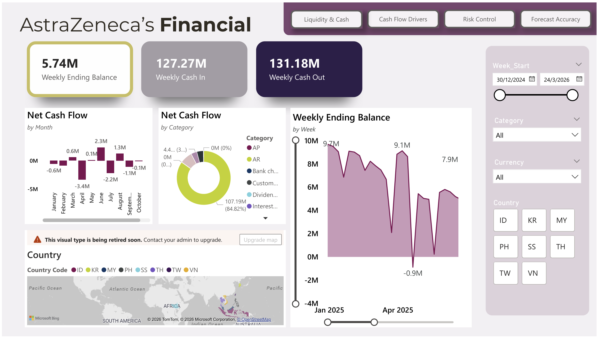
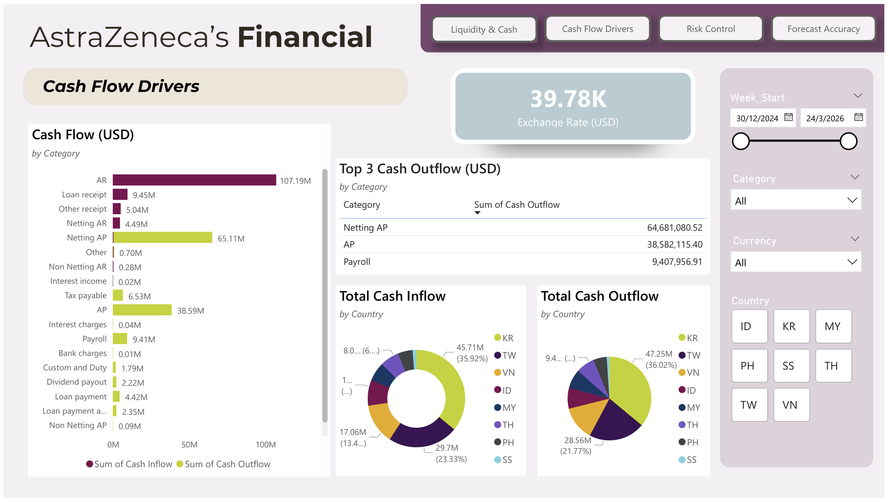
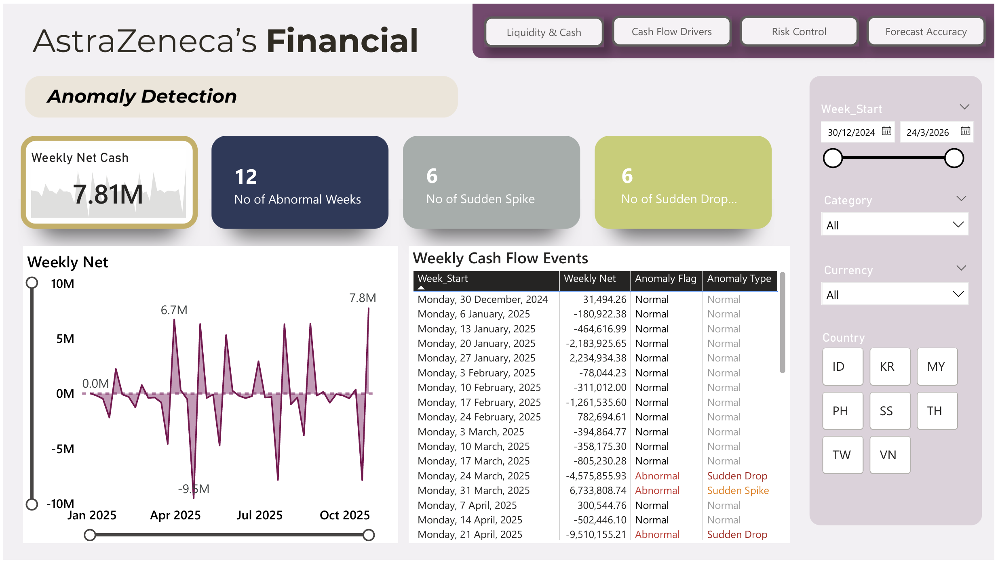
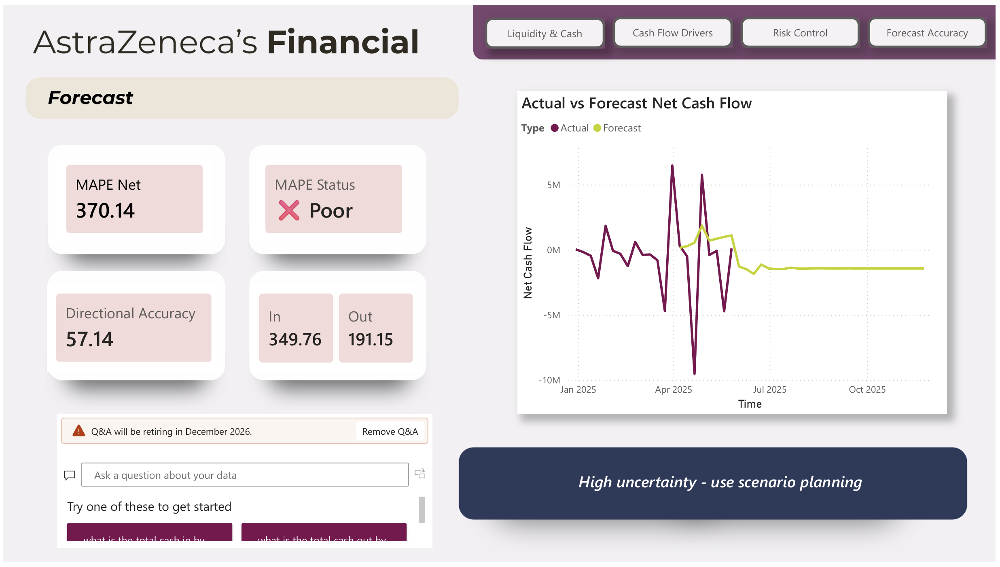

# 💰 Cash Flow Intelligence Dashboard & Forecasting System

## 📌 Overview

This project was developed as part of the UMDAC Datathon, focusing on analyzing and forecasting cash flow to support financial decision-making. (Group: WOW)

The goal was to provide finance teams with better visibility into short-term liquidity, identify abnormal cash flow behavior, and evaluate the reliability of forecasting models.

---

## 🧠 Problem Statement

Finance teams often lack reliable short-term visibility into weekly cash positions due to:
* Irregular cash inflows and outflows
* Complex transaction categories
* Uncertain forecasting accuracy

This leads to challenges in:
* Anticipating liquidity risk
* Trusting forecast results
* Detecting unusual financial activity

---

## 💡 Solution

We developed a **Weekly Cash Control Tower**, integrating:
* 📊 Interactive Power BI dashboard
* 🤖 Python-based forecasting models
* 🚨 Anomaly detection mechanism

---

## 📊 Dashboard Preview

### 🔹 Liquidity & Cash Overview


### 🔹 Cash Flow Drivers


### 🔹 Anomaly Detection


### 🔹 Forecast Analysis


---

## 🔄 Data Processing Pipeline

1. Raw financial transaction data collected
2. Data cleaning (handling missing values, formatting dates)
3. Aggregated transactions into weekly cash flow
4. Feature engineering:
   * Net cash flow
   * Weekly ending balance
5. Data used for dashboard visualization and forecasting

---

## ⚙️ Key Features

### 📊 Cash Flow Monitoring

* Weekly cash inflow & outflow tracking
* Net cash flow trends
* Ending balance visualization

### 📈 Cash Flow Drivers Analysis

* Identified key contributors:

  * AR → main inflow
  * Netting AP, Payroll → major outflows
* Highlighted concentration of cash movements

### 🚨 Anomaly Detection

* Detected abnormal weeks using threshold logic
* Identified:

  * 6 sudden spikes
  * 6 sudden drops
* Supports early risk detection

### 🤖 Forecasting Models

Implemented multiple time-series approaches:

* Moving Average
* Exponential Smoothing
* Linear Regression
* Median-based method

---

## 📊 Key Insights

* Cash outflows frequently exceeded inflows → cash burn periods
* Cash flow is highly volatile week-to-week
* A small number of categories drive most transactions
* 12 abnormal weeks detected requiring investigation

---

## ⚠️ Forecast Evaluation

* MAPE (Net): **370.14 (Poor)**
* Directional Accuracy: **57.14%**

### 🧠 Interpretation

The results highlight the difficulty of forecasting real-world financial data due to:

* High volatility
* External influencing factors
* Limited predictive features

This emphasizes the importance of:

* Model evaluation
* Transparent reporting
* Using forecasts with caution

---

## 🛠️ Tech Stack

* Power BI (dashboard visualization)
* Python (data processing & forecasting)
* Pandas, NumPy, Scikit-learn

---

## 👩‍💻 My Contribution

* Designed and developed Power BI dashboard
* Performed data analysis and visualization
* Contributed to forecasting implementation
* Interpreted results and presented business insights

---

## 📂 Project Files
```plaintext
/dashboard/ → Power BI Dashboard
/Notebook/ → Python code for the forecast model  
/Presentation/ → Presentation slides 
```

---

## 💡 Business Impact

This system helps finance teams to:

* Monitor weekly liquidity
* Identify abnormal transactions early
* Understand key cash flow drivers
* Make informed decisions despite forecasting uncertainty

---

## 🏆 Experience

Completed in a datathon setting, focusing on:

* Real-world financial data
* Time-constrained problem solving
* Collaborative teamwork

---

## 🚀 Future Improvements

* Apply advanced models (e.g., Prophet, LSTM)
* Incorporate external economic indicators
* Improve feature engineering for better accuracy
* Enhance anomaly detection with ML techniques
